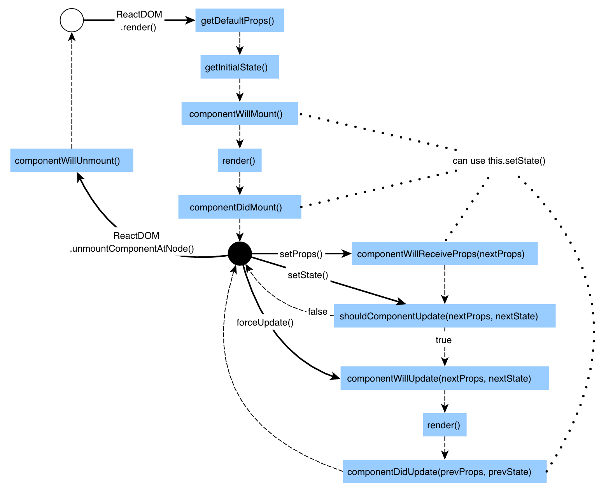

# State And Lifecycle

## Nội dung

- [State là gì?](#state-la-gi)
  - [Sử dụng state trong một class](#su-dung-state-trong-mot-class)
  - [Những điều cần lưu ý khi làm việc với state](#nhung-dieu-can-luu-y-khi-lam-viec-voi-state)
    - [Không được thay đổi state một cách trực tiếp](#khong-duoc-thay-doi-state-mot-cach-truc-tiep)
    - [Cập nhật state có thể không đồng bộ](#cap-nhat-state-co-the-mot-cach-truc-tiep)
    - [Cập nhật state](#cap-nhat-state)
  - [Luồng dữ liệu (Data Flow Down)](#luong-du-lieu-data-flow-down)
- [Lifecycle](#lifecycle)
  - [`componentDidMount()` và `componentWillUnmount()`](#componentdidmount-va-componentwillunmount)
  - [Các phương thức khác trong Lifecycle](#cac-phuong-thuc-khac-trong-lifecycle)

## State là gì?

Mỗi component có 2 thuộc tính (*properties*) là: `props` và `state`. Trong đó, `props` được gán bởi parent (*set by parent*) và chúng có giá trị không đổi trong suốt vòng đời của một component. Để thay đổi được giá trị đó thì chúng ta phải sử dụng `state`. `state` là thuộc tính ta có thể tự xác định được, và chúng phải được xác định là một đối tượng JavaScript đơn giản.

Thông thường bạn nên khởi tạo `state` bên trong `constructor` và gọi hàm `setState()` mỗi khi bạn muốn thay đổi giá trị.

### Sử dụng `state` trong một class

Khởi tạo `state` bên trong `constructor`

```jsx
class Company extends React.Component {
  constructor(props) {
    super(props);
    // Add
    this.state = {name: 'AsianTech'};
    // End
  }
}
```

Sử dụng `this.state` trong `render()`

```jsx
class Company extends React.Component {
  constructor(props) {
    super(props);
    this.state = {name: 'AsianTech'};
  }
  // Add
  render() {
    return (
      <div>
        <h1>Hello, world!</h1>
        <h2>{this.state.name}.</h2>
      </div>
    );
  }
  // End
}
```

Sử dụng `this.setState()` để thay đổi giá trị `state`

```jsx
class Company extends React.Component {
  constructor(props) {
    super(props);
    this.state = {name: 'AsianTech'};
  }
  // Add
  changeName() {
  	this.setState({
        name: 'AsianTech inc'
    })
  }
  //End
  render() {
    return (
      <div>
        <h1>Hello, world!</h1>
        <h2>{this.state.name}.</h2>
      </div>
    );
  }
}
```

### Những điều cần lưu ý khi làm việc với `state`

#### Không được thay đổi `state` một cách trực tiếp

```jsx
// Wrong
this.state.comment = 'Hello';

// Correct (only inside constructor)
this.state = {comment: 'Hello'};

// Correct
this.setState({comment: 'Hello'});
```

Nơi duy nhất mà bạn có thể gán giá trị trực tiếp vào `state` là ở bên trong constructor.

#### Cập nhật `state` có thể không đồng bộ

React có thể gọi hàng loạt `setState()` trong một lần cập nhật duy nhất. 

Bởi vì `this.props` và `this.state` có thể được cập nhật không đồng bộ, bạn không nên dựa vào các giá trị của nó để tính `state` tiếp theo.

```jsx
// Wrong
this.setState({
  counter: this.state.counter + this.props.increment,
});

// Correct
this.setState((prevState, props) => ({
  counter: prevState.counter + props.increment
}));
```

Để khắc phục, ta truyền vào `setState()` một hàm chứ không phải một đối tượng. Hàm này sẽ nhận trạng thái trước đó (`prevState`) là đối số đầu tiên và `props` là đối số thứ hai.

Có thể dùng `arrow function` như trên, nhưng các hàm theo cách thông thường vẫn hoạt động ổn định.

```jsx
// Correct
this.setState(function(prevState, props) {
  return {
    counter: prevState.counter + props.increment
  };
});
```

#### Cập nhật `state`

Khi gọi `setState()`, các đối tượng được cung cấp sẽ được sát nhập (*merged*) vào `state` hiện tại.

Ví dụ với một `state` có nhiều biến khác nhau.

```jsx
constructor(props) {
  super(props);
  this.state = {
    posts: [],
    comments: []
  };
}
```

Sau đó có thể cập nhật các biến đó một cách độc lập với các `setState()` riêng biệt.

```jsx
fetchPosts(response) {
  this.setState({
    posts: response.posts
  });
});

fetchComments(response) {
  this.setState({
    comments: response.comments
  });
});
```

`this.setState({comments: response.comments})` chỉ thay đổi `this.state.comments` trong khi `this.state.posts` vẫn giữ nguyên.

### Luồng dữ liệu (Data Flow Down)

Cả thành phần cha cũng như thành phần con không thể biết một thành phần (*component*) nào đó có `state` (*stateful*) hoặc không có `state` (*stateless*), và chúng không nên quan tâm cho dù nó được định nghĩa là một chức năng (*function*) hay một lớp (*class*).

`state` thường được gọi ở nơi sở hữu nó hoặc được đóng gói lại và các component khác không truy cập được nó.

Một thành phần có thể chọn chuyển `state` của nó xuống thành phần con dưới dạng `props` của thành phần con.

```jsx
class Company extends React.Component {
  constructor(props) {
    super(props);
    this.state = {name: 'AsianTech'};
  }
  
  function Name(props) {
    return <h2>{props.name}.</h2>;
  }
  
  render() {
    return (
      <div>
        <h1>Hello, world!</h1>
        <Name name={this.state.name} />
      </div>
    );
  }
}

```

Thành phần `Name` sẽ nhận `name` từ `props` của nó, và nó không thể biết được `name` được truyền từ đâu tới.

Đây thường được gọi là luồng dữ liệu "từ trên xuống" (*top-down*) hoặc "không đồng bộ" (*unidirectional*). Bất kỳ `state` nào cũng thuộc sở hữu của một số thành phần cụ thể và bất kỳ dữ liệu hoặc giao diện người dùng nào được lấy từ `state` đó chỉ có thể ảnh hưởng đến các thành phần "bên dưới" chúng trong cây.

Trong ứng dụng React, cho dù một thành phần là có `state` hoặc không có `state` được xem là chi tiết triển khai của thành phần có thể thay đổi theo thời gian. Bạn có thể sử dụng các thành phần không có `state` bên trong các thành phần có `state`, và ngược lại.

## Lifecycle

### `componentDidMount()` và `componentWillUnmount()`

Trong các ứng dụng với nhiều thành phần (*components*), điều quan trọng là phải giải phóng tài nguyên (*resources*) do các thành phần tạo ra khi chúng bị phá hủy (*destroyed*).

Ví dụ, muốn thiết lập một bộ đếm thời gian bất cứ khi nào `<Clock>` được hiển thị trên DOM lần đầu tiên. Thì đây được gọi là "gắn (*mounting*)" trong React.

Và muốn xóa bộ đếm thời gian đó bất cứ khi nào trên DOM khi `<Clock>` bị xóa. Đây được gọi là "tháo (*unmounting*)" trong React.

Có thể khai báo các phương thức đặc biệt trên lớp thành phần để chạy một số code khi một thành phần *mounting* và *unmounting*. Sử dụng `componentDidMount()` và `componentWillUnmount()`

```jsx
class Clock extends React.Component {
  constructor(props) {
    super(props);
    this.state = {date: new Date()};
  }

  componentDidMount() {
	// do something
  }

  componentWillUnmount() {
	// do something
  }

  render() {
    return (
      <div>
        <h1>Hello, world!</h1>
        <h2>It is {this.state.date.toLocaleTimeString()}.</h2>
      </div>
    );
  }
}
```

`componentDidMount()` và `componentWillUnmount()` được gọi là "lifecycle hooks (*vòng đời*)".

Phương thức `componentDidMount()` chạy sau khi thành phần đã được hình thành trên DOM.

```jsx
componentDidMount() {
  this.timerID = setInterval(
    () => this.tick(),
    1000
  );
}
```

Như ví dụ trên, bộ đếm thời gian sẽ bắt đầu chạy khi thành phần đã được hình thành trên DOM.

Trong khi `this.props` được thiết lập bởi React và `this.state` có một ý nghĩa đặc biệt, bạn có thể tự do thêm các trường bổ sung cho các lớp bằng tay nếu bạn cần lưu trữ cái gì đó không được sử dụng cho việc `render()`.

Nếu không sử dụng một cái gì đó cho việc `render()`, thì không nên sử dụng `this.state`.

Phương thức `componentWillUnmount()` sẽ chạy sau khi thành phần đã được tháo dỡ trên DOM.

```jsx
componentWillUnmount() {
  clearInterval(this.timerID);
}
```

`componentDidMount()` và `componentWillUnmount()` là 2 phương thức của **lifecycle** thường được sử dụng.

### Các phương thức khác trong Lifecycle

- `componentWillMount()`: được gọi trước khi thành phần được hình thành trên DOM (*trước khi `render()` diễn ra*)
- `getInitialState()`: Trả lại giá trị ban đầu của `state`
- `getDefaultProps()`: lấy giá trị `props` mặc định, nếu `props` không được cung cấp.
- `shouldComponentUpdate()`: trả về giá trị quyết định xem component có được cập nhật hay không.
- `componentWillReceiveProps()`: được gọi khi `props` thay đổi
- `componentWillUpdate()`: được gọi trước khi thành phần được hình thành lại trên DOM (trước khi re-`render()` diễn ra)
- `componentDidUpdate()`: được gọi sau khi thành phần được hình thành lại trên DOM (sau khi re-`render()` diễn ra)



