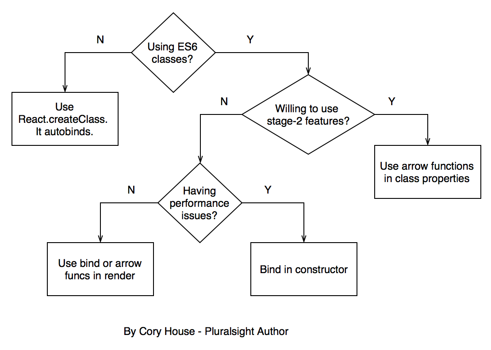

# Handling event
## Nội dung
- [Giới thiệu](#gioi-thieu)
- [Những điều cần chú ý](#nhung-dieu-can-chu-y)
- [Một số giải pháp](#mot-so-giai-phap)
## Giới thiệu
Xử lý sự kiện trong react cũng giống như xử lý sự kiện thông thường nhưng có một số điểm khác:

* Tên sự kiện trong react được viết theo kiểu camelCase, chứ không phải lowercase.
* Tham số truyền vào là một function chứ không phải string.
  ví dụ:

HTML thông thường:
```jsx
<button onclick="activateLasers()">
  Activate Lasers
</button>
```
React:
```jsx
<button onClick={activateLasers}>
  Activate Lasers
</button>
```
Một số điểm khác chúng ta không thể ngăn chặn events bằng   `return false` mà bạn phải gọi `preventDefault` trong hàm handle event

HTML:
```jsx
<a href="#" onclick="console.log('The link was clicked.'); return false">
  Click me
</a>
```
React:
```jsx
function ActionLink() {
  function handleClick(e) {
    e.preventDefault();
    console.log('The link was clicked.');
  }

  return (
    <a href="#" onClick={handleClick}>
      Click me
    </a>
  );
}
```

Trong ví dụ trên, `e` là một [SyntheticEvent](https://reactjs.org/docs/events.html).

Handle sự kiện trong ES6

```jsx
class Toggle extends React.Component {
  constructor(props) {
    super(props);
    this.state = {isToggleOn: true};

    // This binding is necessary to make `this` work in the callback
    this.handleClick = this.handleClick.bind(this);
  }

  handleClick() {
    this.setState(prevState => ({
      isToggleOn: !prevState.isToggleOn
    }));
  }

  render() {
    return (
      <button onClick={this.handleClick}>
        {this.state.isToggleOn ? 'ON' : 'OFF'}
      </button>
    );
  }
}

ReactDOM.render(
  <Toggle />,
  document.getElementById('root')
);
```
## Những điều cần chú ý

Từ khóa `this` trong javascript gây ra nhiều sự nhầm lẫn của các lập trình viên. Bởi vì trong JavaScript, mặc định các class methods không bị ràng buộc ([bound](https://developer.mozilla.org/en-US/docs/Web/JavaScript/Reference/Global_objects/Function/bind)). Tức là nếu chúng ta quên ràng buộc (bind) `this.handleClick` và truyền nó vào `onClick`, `this` sẽ là `undefined` khi mà function được gọi. Xét qua ví dụ sau:

```jsx
export default class ExampleComponent extends React.Component {
    onClickHander() {
        this.setState({clicked: true});
    }

    render() {
        return (
            <div onClick={this.onClickHandler} />
        );
    }
}
```

Đoạn code trên không hề có lỗi cú pháp, nhưng component sẽ không hoạt động đúng. Khi chúng ta click, chúng ta sẽ gặp lỗi `this.setState is not a function`. Lý do rất đơn giản, khi `this.onClickHandler` được gọi, context bên trong của function thay đổi và `this` references sai đối tượng.

[Tìm hiểu thêm về cách hoạt động của function trong JavaScript](https://www.smashingmagazine.com/2014/01/understanding-javascript-function-prototype-bind/). Thông thường, nếu bạn tham chiếu đến một method mà không có cặp dấu `()` ở đằng sau, như thế này `onClick={this.handleClick}` thì bạn nên [bind method](https://developer.mozilla.org/en-US/docs/Web/JavaScript/Reference/Global_objects/Function/bind) đó.

## Một số giải pháp

### Sử dụng React.createClass

React vẫn hỗ trợ phương pháp `React.createClass()` để tạo các component. [React tự động bind tất cả các function](https://reactjs.org/tutorial/tutorial.html#events) Nên nếu cần thiết, chúng ta vẫn có thể tiếp tục sử dụng chúng (cho đến khi nào React bỏ nó đi).

```jsx
// This magically works with React.createClass
// because `this` is bound for you.
onChange={this.onClickHandler}
```

- Ưu điểm:

  - Binding tự động

- Nhược điểm:

  - Non-standard.


  - Có thể tương lai sẽ không dùng được nữa

### `Bind` hoặc dùng `arrow function` trong render

`Bind`:

```jsx
render() {
    return <div onClick={this.onClickHandler.bind(this)} />
};
```
`Arrow function`

```jsx
render() {
    return <div onClick={e => this.onClickHandler(e)} />
};
```

* Ưu điểm:
  * Ngắn, rõ ràng
  * Dễ đọc
* Nhược điểm:
  * Hiệu suất bị ảnh hưỡng mỗi lần render thì function lại được cấp phát (reallocated)
    Nên tránh dùng bind hay arrow function bên trong render

### `Bind` ngay khi khởi tạo
Để tránh khỏi việc binding trong render, chúng ta có thể `bind` trong constructor ngay từ khi khởi tạo component, ví dụ như sau:
```jsx
export default class ExampleComponent extends Component {
    constructor(props) {
        super(props);
        this.onClickHandler = this.onClickHandler.bind(this);
    }
}
```
* Ưu điểm:

  * Mang lại hiệu suất tốt hơn
* Nhược điểm:

  * Có thể bị quên bind cho một phương thức nào đó

  * Chúng ta cần suy xét cẩn thận phương thức nào cần bind, phương thức nào không

  * Phương thức không thể "live reload".

    ​

### Sử dụng arrow function làm class method

Kỹ thuật này dựa vào [proposed class property feature](https://github.com/jeffmo/es-class-public-fields). Để dùng cách này cần có plugin [transform-class-properties](http://babeljs.io/docs/plugins/transform-class-properties) hoặc [enable stage-2 in Babel](http://babeljs.io/docs/plugins/preset-stage-2/).

```jsx
onClickHandler = () => {
  // call this function from render 
  // and this.whatever in here works fine.
}
```

- Ưu điểm:
  - Arrow functions tự động được bind
  - Có thể hot reload
  - Tránh được vấn đề về performance
- Nhược điểm:
  - Phương pháp này vẫn chưa được công bố chính thức, thậm chí nó mới là proposal. Nó có thể không được chấp nhận.

### Tổng kết

Tóm lại chúng ta nên sử dụng cách nào trong những cách đã được nêu ra ở trên, sơ đồ sau giúp ta đưa ra quyết định.

### 

