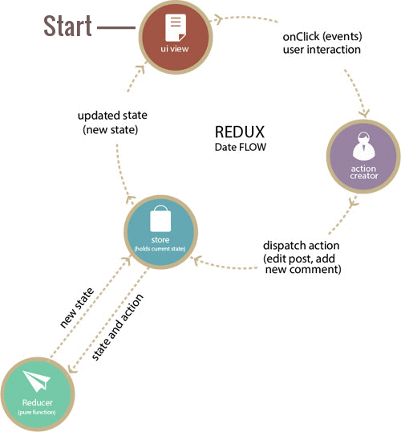

# Redux

## Nội dung


- [Giới thiệu](#gioi-thieu)
- [Structure](#structure)
- [Action Creator](#action-creator)
- [Reducer](#reducer)
- [Store](#store)
- [Data folow](#data-folow)
- [Installation](#installation)
- [React Redux](#react-redux)

## Giới thiệu

Redux được xây dựng dựa trên nền tảng tư tưởng của ngôn ngữ [Elm](http://elm-lang.org/) và kiến trúc [Flux](https://facebook.github.io/flux/docs/overview.html#content) do Facebook giới thiệu. Do vậy Redux là bộ đôi kết hợp hoàn hảo với React Native. Tuy nhiên Redux có thể sử dụng với các framework khác như Angular, Angular2, Backbone, Falcor, Deku.

## Structure

- Redux được xây dựng dựa trên 3 nguyên lý:
  - Nguồn dữ liệu duy nhất: State của toàn bộ ứng dụng được chứa trong một object tree nằm trong Store duy nhất
  - State is read-only: Cách duy nhất để thay đổi State của ứng dụng là phát một Action (là 1 object mô tả những gì xảy ra)
  - Thay đổi chỉ bằng hàm thuần túy: Để chỉ ra cách mà State được biến đổi bởi Action chúng ta dùng các pure function gọi là Reducer
- Cấu trúc:



## Action Creator

- Đây là nơi tạo ra các hành động, là bước đầu tiên trong luồng mà các thay đổi và tương tác đều đi qua. Bất cứ khi nào trạng thái của ứng dụng web hay là hiển thị của view thay đổi thì đầu tiên là một hành động được tạo ra.
- Action Creator trả về một đối tượng chứa type và thông tin của hành động sẽ thay đổi Store. Type thường là một hằng số được định nghĩa trước. Hằng số này sẽ quyết định hành động nào được thực hiện. Trong các ứng dụng lớn type sẽ được chia riêng thành một thư mục riêng để dễ quản lý.

```js
export const increment = () => {
  type: 'INCREMENT'
}
```

## Reducer

- Action Creator miêu tả thực tế một sự thay đổi nhưng không xác định cách mà state của ứng dụng thay đổi. Đây là công việc của Reducer.
- Để kết nối Action Creator và Reducer, Redux sử dụng phương thức dispatch(). Mỗi khi một hành động được gửi tới, Reducer sẽ xác định state mới và trả về cho Store. Sau đó Store sẽ cập nhập cho view.

```js
function counter(state = 0, action) {
  switch (action.type) {
  case 'INCREMENT':
    return state + 1
  default:
    return state
  }
}
```

## Store

- Đây là nơi chứa tất cả state của ứng dụng. Redux cung cấp một phương thức createStore để khởi tạo Store.
```js
let store = createStore(
  reducer
);
```

- Chỉ có một cách để thay đổi state trong Store bằng cách gửi một action qua phương thức dispatch.
  - Ví dụ:
  ```js
  import { createStore } from 'redux'

  // reducer
  function counter(state = 0, action) {
    switch (action.type) {
    case 'INCREMENT':
      return state + 1
    default:
      return state
    }
  }

  // create store
  let store = createStore(counter)

  store.dispatch({type: 'INCREMENT'}) // state = 1
  ```
- Chỉ có duy nhất một Store trong một ứng dụng.

## Data Folow

- Luồng dữ liệu trong một ứng dụng Redux chỉ theo một hướng duy nhất: view -> action -> reducer -> store.
- Vòng đời dữ liệu trong ứng dụng Redux tuân theo 4 bước:
  - Đầu tiên, người dùng phát một hành động, hành động đó được gửi đến Store bằng phương thức dispatch.
  - Tiếp theo, Store sẽ gửi hành động đó và state hiện tại của ứng dụng cho Reducer. Dựa theo type của hành động mà Reducer sẽ quyết định state được gửi lại cho Store.
  - Tất cả state được tổng hợp và gửi cho Store.
  - Store sẽ so sánh và thay đổi state cũ bằng state mới rồi trả lại cho view.

## Installation

```shell
npm install --save redux
```
##React Redux

- Installation
  `npm install --save react-redux`

- Đây là một thư viện dùng để kết nối redux và react native.
- `<Provider store>`: Đây là một component đặc biệt của `react-redux`, nó cho phép ta có thể dùng hàm connect() để kết nối redux và react native.
```jsx
export default class GuestApp extends Component {
  render() {
    return (
      <Provider store={store}>
        <App />
      </Provider>
    );
  }
}
```
- connect([mapStateToProps], [mapDispatchToProps], [mergeProps], [options]): Kết nối react native component và redux store.
  - [`mapStateToProps(state, [ownProps]): stateProps`] (Function): Nếu thông số này được xác định, component sẽ được đăng ký với Redux. Mỗi khi Store thay đổi, `mapStateToProps` sẽ được gọi, kết quả của nó phải là một plain object và được đưa vào component thông qua `props`. 
    - Khi `ownProps` được khai báo, nó sẽ nhận giá trị giá trị của `props` được khai báo trong component. Ví dụ:
    ```jsx
    import ConnectedComponent from './containers/ConnectedComponent'

    <ConnectedComponent
    value="example"
    />
    ```
    `ownProps` ở đây sẽ là {value: "example"}
    - Ngoài ra `mapStateToProps` có thể trả về một function. Trong trường hợp này, function đó sẽ được sử dụng như là `mapStateToProps` cho một component cụ thể.
    - Mỗi khi container nhận được `new props` thì `mapStateToProps` sẽ được gọi.
  - [`mapDispatchToProps(dispatch, [ownProps]) dispatchProps`] (Object or Function): Nếu đây là một object, mỗi function bên trong sẽ được xem như là một `Action Creator`. Nếu là function, `mapDispatchToProps` sẽ có 2 tham số `dispatch` và `ownProps`. Chúng t sẽ tự định nghĩa cách bind action với `dispatch`, ngoài ra chúng ta có thể sử dụng `bindActionCreators({action}, dispatch)` để tự động bind. 
    - `ownProps`: Tương tự như của `mapStateToProps`.
    - Mỗi khi container nhận được `new props` thì `mapDispatchToProps` sẽ được gọi.
  - [`mergeProps(stateProps, dispatchProps, ownProps): props`] (Function): Nếu được định nghĩa, nó sẽ nhận vào tham số là kết quả của `mapStateToProps`, `mapDispatchToProps` và `parent props`. Object mà nó trả về là `props` được gửi cho container. Nếu không được định nghĩa `Object.assign({}, ownProps, stateProps, dispatchProps)` sẽ được sử dụng mặc định.
  - [`option`] (Object): Nếu được định nghĩa, nó sẽ điều chỉnh hành vi của connector. `connect` có những option sau:
    - [`pure`] (Boolean): Nếu `pure === true`, `connect` sẽ tránh việc `re-render` component. Giá trị mặt định: `true`.
    - [`areStatesEqual`] (Function): Khi `pure === true`, so sánh state của store mới và cũ.
    - [`areOwnPropsEqual`] (Function): Khi `pure === true`, so sánh `props` mới và cũ.
    - [`areStatePropsEqual`] (Function): Khi `pure === true`, so sánh kết quả của `mapStateToProps` với giá trị trước đó của nó.
    - [`areMergedPropsEqual`] (Function): Khi `pure === true`, so sánh kết quả của `mergeProps` với giá trị trước đó của nó.
- Ví dụ:
```js
// action.js
export const increment = () => {
  type: 'INCREMENT'
}
```
```js
// reducer.js
initialize = {
  count: 0
}
export function counter(state = initialize, action) {
  switch (action.type) {
  case 'INCREMENT':
    return state + 1
  default:
    return state
  }
}
```
```js
// store.js
import { createStore } from 'redux'
import { counter } from 'reducer'
  // create store
  let store = createStore(counter)
```
```jsx
// container.js
import React, { Component } from 'react';
import { bindActionCreators } from 'redux';
import { connect } from 'react-redux';
import * as Actions from 'action'
import Counter from 'Counter';

class App extends Component {
  render(){
    let { actions, count} = this.props;
    return(
      <Counter 
        increase={actions.increment}
        counter={counter}
      />
    );
  }
}
function mapStateToProps(state) {
  return{
    count: state.count
  };

}
function mapDispatchToProps(dispatch) {
  return{
    actions: bindActionCreators(Actions, dispatch)
  };
}

export default connect(mapStateToProps, mapDispatchToProps)(App);
```
```jsx
// counter.js
import React, { Component } from 'react';
class Counter extends Component {
  render() {
    let { increase, count} = this.props;
    return(
      <View>
        <Text>{count}</Text>
        <Button
          onPress={increase}
          title="Increase"
        />
      <View/>
    )
  }
}
```
  - Trong lần tạo đầu tiên giá trị `count` là 0 (được khởi tạo tại `initialize` trong `reducer`). Khi user nhấn vào `Increase`, `action increment` sẽ được gọi (truyền vào component bằng `props` thông qua `mapDispatchToProps`), sau đó `action` sẽ được gửi cho `reducer`. Cuối cùng `state` mới được cập nhật và gửi lại cho `view`(`view` nhận state bằng `props` thông qua `mapStateToProps`).